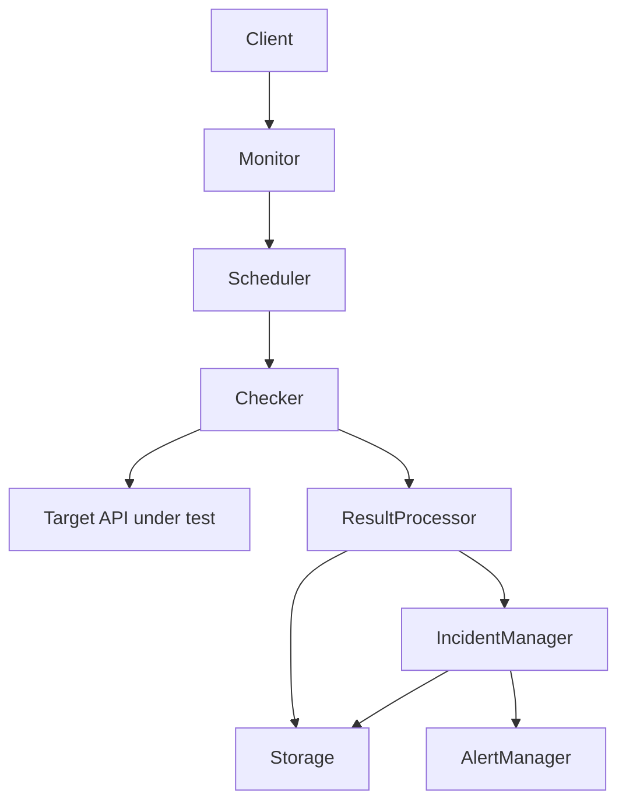

# Architecture

> Status: Milestone 0 — this document describes the intended architecture.
> None of the components below are functionally implemented yet; only their
> package boundaries exist in the repository.

## System overview

API Monitor is a service that periodically checks whether HTTP/HTTPS
endpoints ("targets") are reachable, respond correctly, and respond within
acceptable time, and that keeps a history of those checks so uptime and
incidents can be derived from them.

It is built as a **modular monolith**: a single deployable binary composed
of clearly separated internal packages, each with one responsibility. This
is a deliberate starting point, not a limitation — see
[Future scaling direction](#future-scaling-direction) below.

## Core components

```
Client
   |
   v
API Monitor Service
   |
   +--> Target Management
   |
   +--> Scheduler
   |
   +--> Checker
   |
   +--> Result Processor
   |
   +--> Incident Manager
   |
   +--> Alert Manager
   |
   +--> Storage
```

| Component | Responsibility | Explicitly not responsible for |
|---|---|---|
| Target Management | CRUD and validation of monitored targets (URL, method, expected status, interval). Source of truth for "what to check." | Performing checks, deciding UP/DOWN |
| Scheduler | Deciding *when* each target's next check is due, based on its interval. | Making HTTP requests, interpreting results |
| Checker | Performing one HTTP/HTTPS request against a target; measuring latency, status, timeouts, connection errors. | Deciding whether this constitutes an incident |
| Result Processor | Normalizing a raw check outcome into a stored `CheckResult`; routing it onward. | Alert delivery |
| Incident Manager | Applying failure/recovery thresholds to a stream of results; opening and resolving incidents; owning UP/DOWN state. | Sending notifications |
| Alert Manager | Notifying external systems (initially webhooks) when incident state changes; deduplicating repeated notifications. | Deciding what counts as a failure |
| Storage | Persisting targets, check results, and incidents; serving historical queries. | Business rules about what data means |

Each component has a single reason to change. That is what keeps the
monolith modular instead of tangled, and it is what allows any one
component (most likely Scheduler + Checker) to be pulled out into a
separately deployable service later without rewriting the others.

## Data flow



Walking through it:

1. A **target** is registered through Target Management (eventually via the
   REST API).
2. The **Scheduler** determines the target is due for a check and triggers
   the **Checker**.
3. The **Checker** performs the HTTP/HTTPS request against the real target
   API and records latency, status code, and any error/timeout.
4. The **Result Processor** turns that raw outcome into a `CheckResult` and
   sends it to **Storage** and to the **Incident Manager**.
5. The **Incident Manager** applies threshold rules (e.g., N consecutive
   failures) to decide if a target's state should flip between UP and
   DOWN, and records incident open/resolve events in Storage.
6. On a state transition, the **Incident Manager** notifies the **Alert
   Manager**, which delivers a notification (e.g., a webhook call).
7. The **Client** (a person or another InfraVex tool) reads current state
   and history back out through the REST API, backed by Storage.

## Future scaling direction

The modular monolith is intentionally structured so that scaling out later
is a matter of changing *wiring*, not rewriting logic:

- **Scheduler + Checker** are the natural first extraction point: they can
  become one or more independent **worker** processes that pull due checks
  from a **queue**, so check volume can scale independently of the rest of
  the service.
- Workers could run from multiple **regions**, each reporting results back
  through the same `CheckResult` contract, enabling multi-region
  monitoring without changing how results are interpreted downstream.
- **Storage** already sits behind package boundaries used only through
  interfaces defined by their consumers, so the backing store can change
  (or be split, e.g. hot recent-results store vs. cold historical store)
  without touching business logic.
- **Incident Manager** and **Alert Manager** stay centralized longer, since
  incident state needs a single source of truth even if checks become
  distributed.

None of this distributed infrastructure is built now. It is a direction the
package boundaries are chosen to keep open, not a plan being implemented in
Milestone 0.
