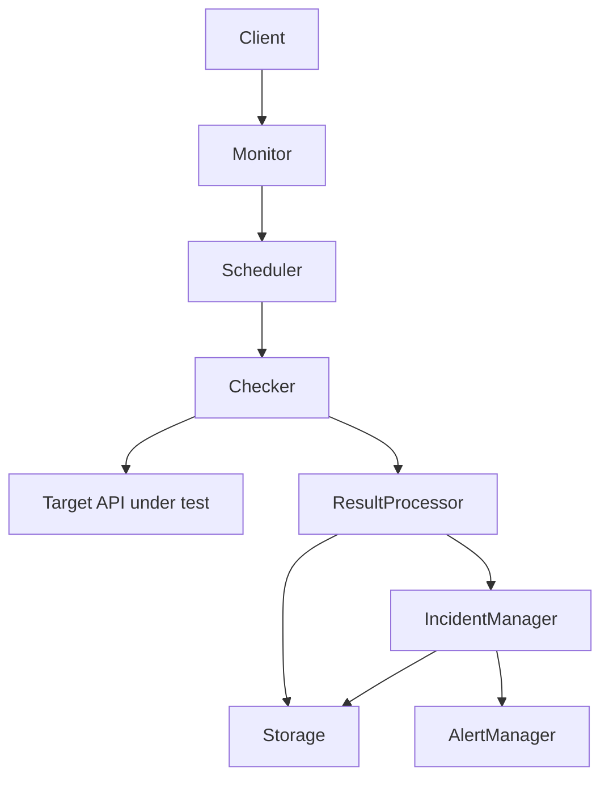

# Architecture

> Status: Milestone 3 — the HTTP Checker (`checker.Checker`) is now
> implemented: given a `target.Target`, it performs one real HTTP/HTTPS
> request and returns a `checker.CheckResult`. It is a standalone,
> fully-tested package-level component — nothing in the running
> application calls it yet. No scheduler exists to invoke it periodically
> (M4), no worker pool runs it concurrently at scale (M5), and nothing
> persists its results (M6) or reacts to them (M7/M8). See
> [The HTTP Checker (Milestone 3)](#the-http-checker-milestone-3) below for
> what's actually implemented vs. the target design in
> [Core components](#core-components).

## System overview

API Monitor is a service that periodically checks whether HTTP/HTTPS
endpoints ("targets") are reachable, respond correctly, and respond within
acceptable time, and that keeps a history of those checks so uptime and
incidents can be derived from them.

It is built as a **modular monolith**: a single deployable binary composed
of clearly separated internal packages, each with one responsibility. This
is a deliberate starting point, not a limitation — see
[Future scaling direction](#future-scaling-direction) below.

## Core components

```
Client
   |
   v
API Monitor Service
   |
   +--> Target Management
   |
   +--> Scheduler
   |
   +--> Checker
   |
   +--> Result Processor
   |
   +--> Incident Manager
   |
   +--> Alert Manager
   |
   +--> Storage
```

| Component | Responsibility | Explicitly not responsible for |
|---|---|---|
| Target Management | CRUD and validation of monitored targets (URL, method, expected status, interval). Source of truth for "what to check." | Performing checks, deciding UP/DOWN |
| Scheduler | Deciding *when* each target's next check is due, based on its interval. | Making HTTP requests, interpreting results |
| Checker | Performing one HTTP/HTTPS request against a target; measuring latency, status, timeouts, connection errors. | Deciding whether this constitutes an incident |
| Result Processor | Normalizing a raw check outcome into a stored `CheckResult`; routing it onward. | Alert delivery |
| Incident Manager | Applying failure/recovery thresholds to a stream of results; opening and resolving incidents; owning UP/DOWN state. | Sending notifications |
| Alert Manager | Notifying external systems (initially webhooks) when incident state changes; deduplicating repeated notifications. | Deciding what counts as a failure |
| Storage | Persisting targets, check results, and incidents; serving historical queries. | Business rules about what data means |

Each component has a single reason to change. That is what keeps the
monolith modular instead of tangled, and it is what allows any one
component (most likely Scheduler + Checker) to be pulled out into a
separately deployable service later without rewriting the others.

## Data flow



Walking through it:

1. A **target** is registered through Target Management (eventually via the
   REST API).
2. The **Scheduler** determines the target is due for a check and triggers
   the **Checker**.
3. The **Checker** performs the HTTP/HTTPS request against the real target
   API and records latency, status code, and any error/timeout.
4. The **Result Processor** turns that raw outcome into a `CheckResult` and
   sends it to **Storage** and to the **Incident Manager**.
5. The **Incident Manager** applies threshold rules (e.g., N consecutive
   failures) to decide if a target's state should flip between UP and
   DOWN, and records incident open/resolve events in Storage.
6. On a state transition, the **Incident Manager** notifies the **Alert
   Manager**, which delivers a notification (e.g., a webhook call).
7. The **Client** (a person or another InfraVex tool) reads current state
   and history back out through the REST API, backed by Storage.

## Future scaling direction

The modular monolith is intentionally structured so that scaling out later
is a matter of changing *wiring*, not rewriting logic:

- **Scheduler + Checker** are the natural first extraction point: they can
  become one or more independent **worker** processes that pull due checks
  from a **queue**, so check volume can scale independently of the rest of
  the service.
- Workers could run from multiple **regions**, each reporting results back
  through the same `CheckResult` contract, enabling multi-region
  monitoring without changing how results are interpreted downstream.
- **Storage** already sits behind package boundaries used only through
  interfaces defined by their consumers, so the backing store can change
  (or be split, e.g. hot recent-results store vs. cold historical store)
  without touching business logic.
- **Incident Manager** and **Alert Manager** stay centralized longer, since
  incident state needs a single source of truth even if checks become
  distributed.

None of this distributed infrastructure is built now. It is a direction the
package boundaries are chosen to keep open, not a plan being implemented in
Milestone 0.

## Domain model (Milestone 1)

Three domain types now exist, each owned by the package most responsible
for producing or acting on it:

```
Target
   │
   │ monitored by (Scheduler triggers Checker against it — M3/M4)
   ↓
CheckResult
   │
   │ contributes to (Incident Manager applies thresholds — M7)
   ↓
Incident
```

- **`Target`** (`internal/target`) — an HTTP/HTTPS endpoint to check, plus
  the policy for checking it (method, interval, timeout, expected status).
- **`CheckResult`** (`internal/checker`) — the outcome of one check
  attempt. Represented via a stored `Outcome` enum (`success`,
  `unexpected_status`, `timeout`, `connection_error`) rather than a raw
  `Success` bool, so a result can't represent a contradictory state (e.g.
  "successful" with an error message attached). `Success()` is derived from
  `Outcome`.
- **`Incident`** (`internal/incident`) — a period during which a target is
  considered unhealthy. Open vs. resolved is represented solely by whether
  `ResolvedAt` is nil, not a separate status field, for the same
  no-contradictory-state reason. Resolving is a one-way transition in this
  milestone: a resolved incident is terminal, and a later recurrence
  becomes a new incident rather than reopening the old one. The
  failure/recovery *threshold* logic that decides *when* to open or resolve
  an incident belongs to the Incident Manager (M7) — this milestone only
  defines the shape and the open→resolved transition itself.

These three packages currently have no dependencies on each other: IDs
crossing between them (e.g. `CheckResult.TargetID`) are plain `string`
values rather than a shared cross-package type, keeping the packages
independently testable. A small `internal/id` leaf package (UUIDv4 via
`crypto/rand`, no third-party dependency) is shared by all three
constructors purely to avoid duplicating ID-generation code; it carries no
business meaning of its own.

## Request architecture (Milestone 2)

This is what's actually running today for target management — a real
subset of the [Core components](#core-components) design above (Target
Management + Storage), not the full future system:

```
                    Client
                      │
                      ▼
                HTTP Server (net/http, internal/api)
                      │
        Middleware: RequestID → Logging → Recovery
                      │
                      ▼
                TargetHandler (internal/api)
                      │
                      ▼
                target.Service (internal/target)
                      │
                      ▼
                Target domain type + Validate (internal/target, M1)
                      │
                      ▼
                target.Repository interface (internal/target)
                      │
                      ▼
        MemoryTargetRepository (internal/storage) — in-memory only
```

Scheduler, Result Processor, Incident Manager, and Alert Manager from the
[Core components](#core-components) table above are **not** wired into
this flow yet — they remain future components. The Checker exists as of
M3 (see below) but is not called from this HTTP request path at all; it is
invoked directly by its own tests today, with nothing yet triggering it
periodically. So does durable storage: `MemoryTargetRepository` is a
`map[string]Target` behind a mutex;
data is lost on restart. It exists to unblock the REST API before
PostgreSQL arrives (M6), implementing `target.Repository` — an interface
defined by `internal/target` (the consumer), not by `internal/storage`,
so `target` and `api` never depend on a specific storage technology and
swapping in a PostgreSQL-backed implementation in M6 requires no changes
above the repository layer.

The **`Handler → Service → Repository`** split mirrors the same
single-reason-to-change principle as the top-level component table:
`TargetHandler` only knows HTTP (status codes, JSON, path parsing);
`target.Service` only knows application flow (fetch-then-validate-then-save
for updates, defaulting for creates) and is unaware `net/http` exists;
`Target.Validate` (M1) remains the single source of truth for what makes a
target valid — the service and handler both defer to it rather than
re-implementing validation rules at their own layer.

Configuration (`internal/config`) and cross-cutting HTTP middleware
(request ID, structured logging, panic recovery — `internal/api`) round
out the M2 additions; both are described in `docs/development.md` and
`docs/api.md`.

## The HTTP Checker (Milestone 3)

```
Target
   │
   ▼
checker.Checker.Check(ctx, target)
   │
   ▼
HTTP/HTTPS request (net/http, context-bounded by target.Timeout)
   │
   ▼
External API under test
   │
   ▼
Response / error
   │
   ▼
CheckResult (Outcome: success | unexpected_status | timeout |
             connection_error | canceled)
```

`checker.Checker` (`internal/checker/check.go`) answers exactly one
question — *"what happened when we attempted this request?"* — and
nothing else. It is deliberately kept separate from, and unaware of, the
**Incident Manager**: the Checker reports an observation; deciding what a
sequence of observations *means* for a target's overall UP/DOWN state is
the Incident Manager's job (M7), not the Checker's. This mirrors the
`Handler`/`Service` split from M2: each layer answers one question and
defers judgment calls to whichever layer actually owns them.

Key design points (see `internal/checker/check.go`'s doc comments for the
full reasoning):

- **Concrete type, not an interface.** There is exactly one
  implementation of "perform an HTTP check," and no current caller needs
  to substitute a different one — an interface here would be abstraction
  without a reason (`docs/development.md`, principle 6).
- **Per-check context timeout, not `http.Client.Timeout`.** A single
  `*http.Client` is shared across targets with different configured
  `Timeout` values, so the timeout budget is applied per call via
  `context.WithTimeout(ctx, target.Timeout)`, not as a single fixed value
  on the client.
- **`OutcomeCanceled` (new in M3).** The M1 `Outcome` enum could not
  distinguish "the target's own configured timeout elapsed" from "the
  caller aborted the check for operational reasons" (e.g. process
  shutdown). Conflating them would corrupt future incident-detection data
  by misreporting an operational abort as target slowness, so one new
  outcome was added — the smallest domain change that made the
  distinction representable, not a redesign of `CheckResult`.
- **Standard redirect/TLS behavior.** Redirects follow `net/http`'s
  default policy (most real APIs redirect at least once, e.g. http→https);
  TLS uses the default system trust store with no
  `InsecureSkipVerify` — a certificate failure is a real monitoring
  failure, reported as `connection_error`.
- **Bounded body draining.** The response body is drained (capped at 64
  KiB) via `io.Discard` and closed, so the underlying connection can be
  reused on a future check against the same target, without ever buffering
  the content — M3 does not validate response bodies.
- **No persistence, scheduling, or logging inside the Checker.** It
  returns a value; what happens to that value (stored, scheduled again,
  logged, alerted on) is entirely the caller's decision, once a caller
  exists.

This does not change the [Future scaling direction](#future-scaling-direction)
section above — `Checker.Check` was written statelessly and safely for
concurrent use specifically so that M5's worker pool can call it from many
goroutines without modification. That is a property that already holds
today (verified with `go test -race`), not a promise about work still to
come.
